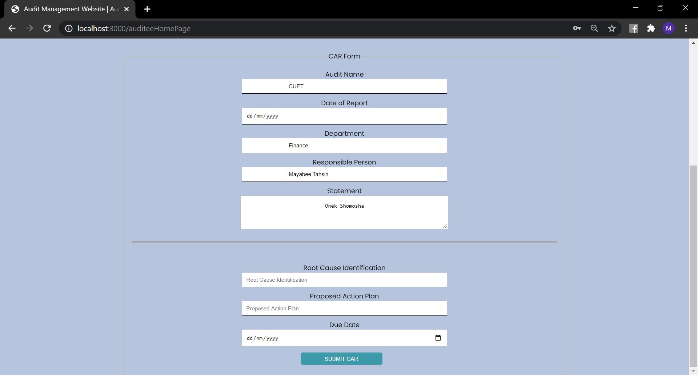

------------Internal Audit Management System---------------

1.Home Page

        -This is the homepage of our website. Clicking the "Proceed to application" button will take you to the login page.

2.Login Page

        -This is the log in page of our website. We have 3 kinds of users: Auditor ,Auditee and Admin.
        -User need to log in with their valid credentials.
        - all the information must match with the saved information in the database
        -No fields can be can me empty while log in

3.Auditor Home page

        -Auditors can see the on going Audits in the home page.
        -After adding a new audit plan it will be visible on the home page.
        -Auditors can add NC plan against an audit plan

4.NC Form

        -Auditors can add one nc against each audit
        -if the nc is added already it can not be edited again.

5.View Proposed CAR

        -Auditors can see the proposed CAR against the audits in a table.

6.Auditee Home page

        -Auditee can see the NCs on the home page and can Add car (correction action request)againd an audit

7.CAR Form

        -Auditee fill up the car form and submit it. The proposed car action will be visible on the auditor's
         "view proposed car" page

8. Admin home Page

        -From homepage admin can go to "add user" page or "manage user page"

9.Add User page

        - Only admin can add users in our system

10.Manage User Page

        -Admin can fix password issues of other users
        -Admin can remove user form the system with their email

11. DataBase

        -All the data are saved in the MongoDB Atlas which is a global cloud database service.